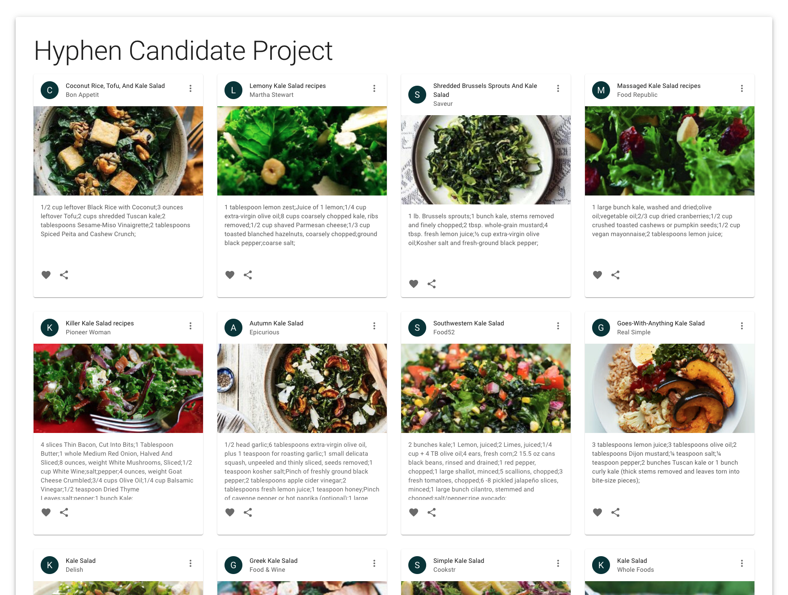

# The Backend Challenge: Add a Read-Through Cache

To get you started we have the basic structure for a recipe catalog web app already completed, and a backend skeleton ready for you to build upon.

Use `yarn start` to run all projects together.

- Open [the frontend](http://localhost:4200/) in your browser. You should see a page with a list of recipes!
- Open [the api](http://localhost:4200/api) in your browser. You should see a "hello world" message.



## About this repository

This repository was bootstrapped using [Nx](https://nx.dev/l/r/getting-started/intro) (a typescript monorepo framework). It's not critical that you are familiar with Nx, but it wouldn't hurt to spend a few minutes reading the [getting started intro](https://nx.dev/getting-started/intro) to familiarize yourself with the toolset.

The frontend uses a [development proxy](https://nx.dev/react-tutorial/06-proxy#react-nx-tutorial---step-6-proxy-configuration) that serves both the frontend and backend on the same port, `4200`, with the backend serving on the path `/api`.

## The challenge

Your challenge is to create a facade to the [Edamam Recipe API (v2)](https://developer.edamam.com/edamam-docs-recipe-api) that adds a layer of caching to the results, often called a read-through cache. This will allow the existing frontend to use less of our quota from the third party. This can be in-memory cache, no need to introduce redis or other external/distributed caches.

### Some tasks to get you started

- [ ] Create an endpoint that matches the Edamam recipe search endpoint
- [ ] Implement the endpoint so that it sends requests to the Edamam api and caches the results
- [ ] Update the frontend project to point to your new endpoint instead of the Edamam api

### When you finish

- Ensure all changes are commited
- Push your branch up to github
- Open a pull request
- Let us know you've finished

---

## Setting up your environment

This app requires NodeJS `16.13.10` (not the latest version). If you don't already have node installed, or need to pin to a specific version, we recommend using [nvm](https://github.com/nvm-sh/nvm).

### NVM Install on Windows (using powershell)

```powershell
# Install the scoop package manager
iwr -useb get.scoop.sh | iex
scoop install git 7zip # Scoop requires git and 7zip to update itself and extract packages

# Install and use NVM
scoop install nodejs nvm
nvm install 16.13.0
nvm use 16.13.0
```

### NVM Install on MacOS

```
brew install nvm
nvm install 16.13.0
nvm use 16.13.0
```

It can also be helpful to have the [Nx cli tools](https://nx.dev/l/r/getting-started/nx-setup) installed globally via `npm install -g nx`

- Clone this repo
- Create a branch for your changes
- Run `yarn` to initialize the project
- Run `yarn nx test` to ensure the existing test suite passes
- Run `yarn nx serve recipe-search` to see the web app in action
- Start adding features!
