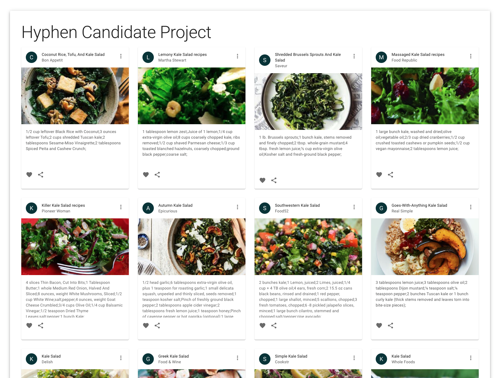

# The Frontend Challenge: Add features to a Recipe Search App

To get you started we have the basic structure for a recipe catalog web app already completed for you to build upon.

After [setting up your environment](#setting-up-your-environment), use `yarn start` to build and run the projects, and open [localhost:4200](http://localhost:4200/) in your browser. You should see a page with a list of recipes!



## About this repository

This repository was bootstrapped using [Nx](https://nx.dev/l/r/getting-started/intro) (a typescript monorepo framework). It's not critical that you are familiar with Nx, but it wouldn't hurt to spend a few minutes reading the [getting started intro](https://nx.dev/getting-started/intro) to familiarize yourself with the toolset.

The frontend uses React, typescript, and has the [Material-UI](https://mui.com/) library already integrated. The [Edamam Recipe API (v2)](https://developer.edamam.com/edamam-docs-recipe-api) is connected and supports all of the additional features that we need.

## The challenge

Your challenge is to complete both new features listed below.

### `Add the ability to search by a phrase and another facet of your choice`

Allow the user to enter a search phrase, and use that string to filter the results from the API. This should just be a standard text input, nothing too fancy. The API supports a `q` parameter to implement this filter. We've hard-coded the phrase "kale salad" to get you started.

The API supports a variety of other filters, like `dishType` and `calories`. Allow the user to specify a filter value and use their selection to filter the results from the API. Most of these are enums or numerical ranges, so be creative about how you present this to the user. There are multiple ways to implement this from a UX perspective... a [list of checkboxes](https://mui.com/components/checkboxes/), or a [multi-select box](https://mui.com/components/selects/#multiple-select), or even [tags](https://mui.com/components/autocomplete/#multiple-values) if you're feeling ambitious!

### `Add the ability to navigate between pages of results`

Allow the user to navigate between multiple pages of results. Right now we are only fetching the first page of results from the API. The API returns a limited number of items per page and includes a `_links.next.href` property in the response to help fetch subsequent pages of results. You could use discrete [buttons](https://mui.com/components/buttons/) for previous and next, or you could try something more complicated like [pagination](https://mui.com/components/pagination/).

### Some tasks to get you started

- [ ] Add an input to accept a search term
- [ ] Connect the input to component state
- [ ] Implement a side-effect that fetches api results when state changes
- [ ] Add an input to accept another facet
- [ ] Connect the input to component state
- [ ] Refactor the side-effect to include the new facet in the api call
- [ ] Debounce the inputs
- [ ] Add next page buttons
- [ ] Connect the buttons to callbacks that replace the api url with `self.href` or `next.hef` from the api response
- [ ] Make a list of tasks that we need to do to improve architecture and code quality

### Bonus tasks

- [ ] Add previous page buttons
- [ ] Implement skeleton for loading status (assets/sk.png)
- [ ] Implement UI like (assets/demo.gif) (assets/another.gif) (assets/sug.png)

### When you finish

- Ensure all changes are commited
- Push your branch up to github
- Open a pull request
- Let us know you've finished

---

## Setting up your environment

This app requires NodeJS `16.13.10` (not the latest version). If you don't already have node installed, or need to pin to a specific version, we recommend using [nvm](https://github.com/nvm-sh/nvm).

### NVM Install on Windows (using powershell)

```powershell
# Install the scoop package manager
iwr -useb get.scoop.sh | iex
scoop install git 7zip # Scoop requires git and 7zip to update itself and extract packages

# Install and use NVM
scoop install nodejs nvm
nvm install 16.13.0
nvm use 16.13.0
```

### NVM Install on MacOS

```
brew install nvm
nvm install 16.13.0
nvm use 16.13.0
```

It can also be helpful to have the [Nx cli tools](https://nx.dev/l/r/getting-started/nx-setup) installed globally via `npm install -g nx`

- Clone this repo
- Create a branch for your changes
- Run `yarn` to initialize the project
- Run `yarn nx test` to ensure the existing test suite passes
- Run `yarn nx serve recipe-search` to see the web app in action
- Start adding features!
